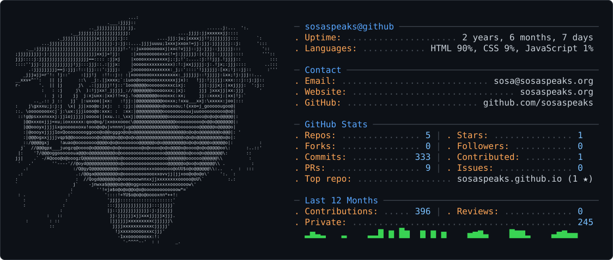

<picture>
  <source media="(prefers-color-scheme: dark)" srcset="sosaspeaks-logo-wht.png" />
  <source media="(prefers-color-scheme: light)" srcset="sosaspeaks-logo-blk.png" />
  
</picture>

---

> ### “How it is we have so much information, but know so little?”

<picture>
  <source media="(prefers-color-scheme: dark)" srcset="dark_mode.svg" />
  <source media="(prefers-color-scheme: light)" srcset="light_mode.svg" />
  
</picture>

🎓 *Computer Science @ Northeastern University*
🎻 *10+ years on violin*

### Books I'm currently reading
<!-- GOODREADS-LIST:START -->
<!-- GOODREADS-LIST:END -->

---

## ✍️ Featured Articles
> Essays, critiques, and reflections from [SosaSpeaks.org](https://sosaspeaks.org)

- #### 📰 [CFC: Netanyahu's Address to Congress](https://sosaspeaks.org/articles/bibicongressone081424.html)
> Contextualizing and Fact-Checking (CFC) Prime Minister of Israel Benjamin Netanyahu's Address to Congress on July 24, 2024.

- #### 🗞 [From Momentum to Mediocrity: A Campaign That Lost Its Spark](https://sosaspeaks.org/articles/kamalacampaign110424.html)
> Critiquing the rushed, idealist presidential campaign of Kamala Harris in 2024.

- #### 🔎 [The Moral Dilemma of Defying Law for One’s Convictions](https://sosaspeaks.org/articles/defyinglaw050124.html)
> Cowritten with peer *rawls*, analyzing when law conflicts with morals.

